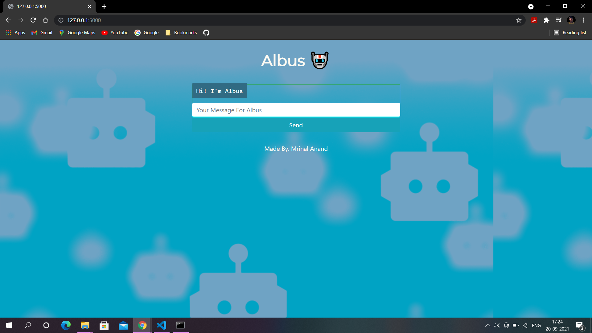
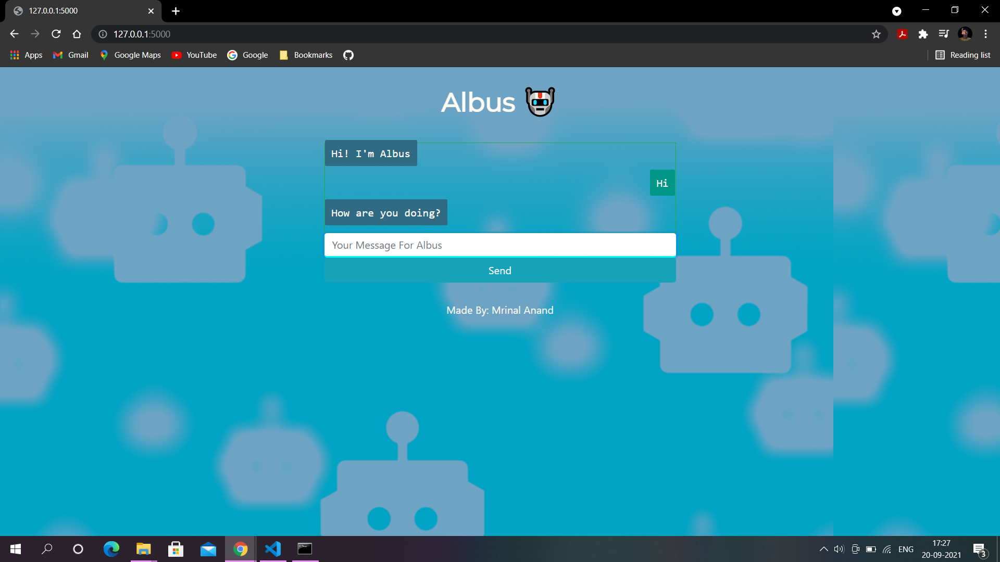

# Chatbot
To make an interactive chatbot named Albus, in python using the Chatterbot library.

## Working of Code:
* Make a web app using Flask framework.
* Render the template containing HTML and CSS to the app.
* Train the bot using Chatterbot-corpus.
* Make conversation with the chatbot.

## File-wise Explanation:
* db.sqlite3 : training data for the chatbot.
* app.py : deploys the model using Flask framework, by importing Chatterbot library.
* index.html : html file for the chatbot.
* styles.css : contains styling for the page.

## Result Snippets: 

